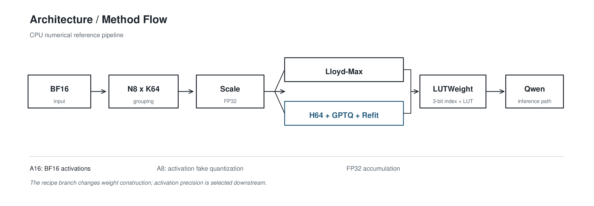
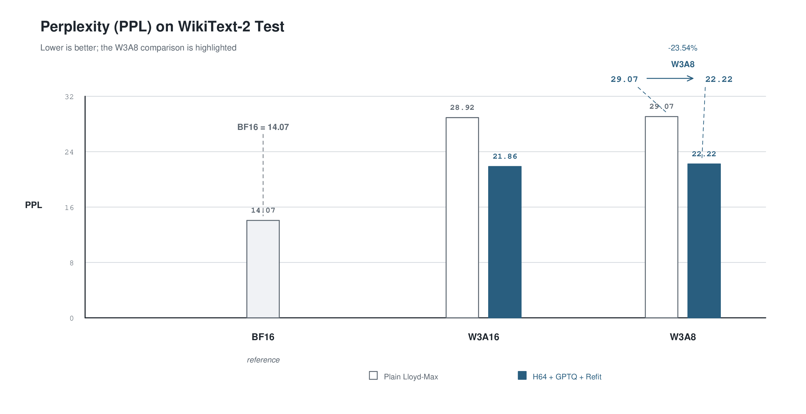

# Rubin LUT-W3A8/W3A16 CPU Numerical Reference

This repository contains a CPU numerical reference for LUT-based W3A8 and
W3A16 configurations used in a Rubin-related study. It models the logical
behavior and quantization recipe defined by this project; it is not a hardware
emulator and does not make throughput, latency, energy, CUDA, PTX, or Tensor
Core claims. The repository includes the implementation, tests,
reproducibility checks, and recorded evaluation artifacts for inspection and
reruns.

The numerical definition is documented in
[`docs/numerical_spec_v1.md`](docs/numerical_spec_v1.md), and the final
technical report is [`docs/final_report.md`](docs/final_report.md).

## Environment and model

The recorded environment is Python 3.14 (`.python-version`) with dependencies
frozen by [`uv.lock`](uv.lock):

```bash
uv sync --locked
```

Place the local checkpoint at `models/Qwen3-0.6B-Base`. The evaluator always
uses `local_files_only=True`; it does not download or substitute another
model.

## Tests and sanity checks

```bash
uv run pytest -q
uv run python scripts/sanity_linear.py
uv run python scripts/sanity_block.py --model-path models/Qwen3-0.6B-Base
```

The evaluator and full-model sanity path accept only `--device cpu`.

## Reproduce the recorded results

The recorded protocol uses Qwen3-0.6B-Base, WikiText-2 raw test, 1024-token
sequences, 32768 evaluation tokens, seed 42, and CPU-only execution:

```bash
uv run python scripts/eval_qwen.py --mode bf16 \
  --model-path models/Qwen3-0.6B-Base --dataset Salesforce/wikitext \
  --dataset-config wikitext-2-raw-v1 --split test --seq-len 1024 \
  --max-eval-tokens 32768 --device cpu --seed 42 \
  --output results/bf16.json

uv run python scripts/eval_qwen.py --mode w3a8 \
  --model-path models/Qwen3-0.6B-Base --dataset Salesforce/wikitext \
  --dataset-config wikitext-2-raw-v1 --split test --seq-len 1024 \
  --max-eval-tokens 32768 --device cpu --seed 42 \
  --output results/w3a8.json

uv run python scripts/eval_qwen.py --mode w3a16 \
  --model-path models/Qwen3-0.6B-Base --dataset Salesforce/wikitext \
  --dataset-config wikitext-2-raw-v1 --split test --seq-len 1024 \
  --max-eval-tokens 32768 --device cpu --seed 42 \
  --output results/w3a16.json

uv run python scripts/compare_results.py \
  results/bf16.json results/w3a8.json \
  --w3a16-json results/w3a16.json \
  --output results/summary.csv \
  --attribution-output results/attribution.csv
```

`compare_results.py` refuses to write a summary when required experiment
metadata differs or when `ppl` is not consistent with `exp(mean_nll)`.

## Recorded reference result

| Mode | mean NLL | PPL | Δmean NLL | ΔPPL |
|---|---:|---:|---:|---:|
| BF16 | 2.64401770896576 | 14.069617833591494 | — | — |
| LUT-W3A16 | 3.3644417383337535 | 28.917349344449057 | 0.7204240293679933 | 14.847731510857564 |
| LUT-W3A8 | 3.3695883653031067 | 29.066559790365766 | 0.7255706563373465 | 14.996941956774272 |

Machine-readable results and acceptance logs are in
[`results/`](results/). `results/attribution.csv` reports mean-NLL deltas for
weight quantization, activation quantization on W3 weights, and total
quantization. The complete interpretation and limitations are in
[`docs/final_report.md`](docs/final_report.md).

The 1.2 GB model weight file is intentionally not committed to Git. Supply it
separately at `models/Qwen3-0.6B-Base`.

## Publication figures

The following English academic-style figures summarize the fixed comparison.
They are generated from
[`results/quantization_comparison/summary.csv`](results/quantization_comparison/summary.csv):



*Figure 1. Architecture and method flow for the shared BF16 input path and the two W3 recipes.*



*Figure 2. PPL comparison, highlighting the W3A8 change from 29.07 to 22.22 while retaining the BF16 reference at 14.07.*

The complete five-row table is also available as the standalone PNG artifact
[`results/figures/main_results_table.png`](results/figures/main_results_table.png);
it is not embedded here because the README already contains the corresponding
numeric tables. Regenerate all figures with:

```bash
python3 scripts/generate_figures.py
```

The figure renderer requires Ghostscript (`gs`) and emits high-resolution PNG
exports.

## Additional quantization comparison

A separate CPU experiment compares plain Lloyd-Max with signed H64 + K64
GPTQ + Hessian-refitted E4M3 LUTs, each in W3A16 and W3A8, sharing BF16.
It preserves this project's FP32 K64 scale rules and the original results.

```bash
uv run python -m scripts.run_quantization_comparison
```

Both WikiText-2 train and test must already be cached; evaluation is offline.
See [experiment protocol](docs/quantization_comparison.md) for the fixed
512-token train calibration, payload reuse, reference-source differences,
and reproducibility instructions.

Recorded comparison (shared BF16 PPL: 14.0696):

| Recipe | W3A16 PPL | W3A8 PPL |
|---|---:|---:|
| plain Lloyd-Max | 28.9173 | 29.0666 |
| H64 + GPTQ + refitted LUT | 21.8577 | 22.2245 |

All 42 tests passed. With 20 evaluation threads, all three historical
baselines reproduce exactly. See [results](results/quantization_comparison/summary.csv)
and the experiment report for metadata, calibration, and threading details.
